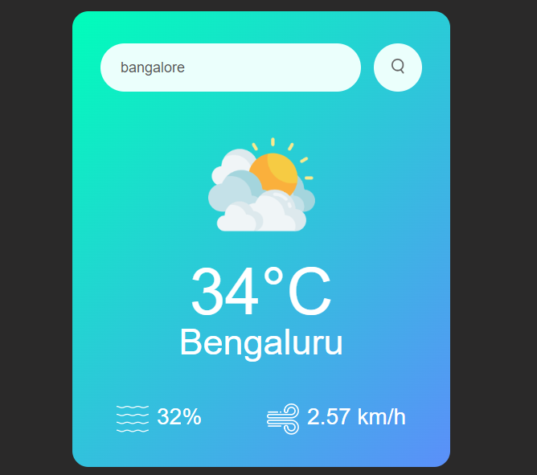

# Overview

This is a simple weather application named open-weather, designed to display current weather information for a city using the OpenWeatherMap API. It includes a simple and user-friendly interface with a search bar where users can enter a city name to retrieve weather details such as temperature, humidity, wind speed, and a weather icon representing the current weather conditions. The background color of the app changes dynamically based on the weather conditions (cloudy, clear, rainy, drizzle, mist).

## Frontend

## Files

- `index.html`: Contains the structure of the weather app, including input fields, weather display elements, and links to CSS and JavaScript files.
- `style.css`: Defines the styles for the weather app, including card layout, search bar, weather icons, and weather details.
- `script.js`: Implements the functionality of fetching weather data from the OpenWeatherMap API based on user input, updating the DOM with weather information, and dynamically changing the background and weather icon based on weather conditions.
- `images`: Stores icons for the frontend.

## Features

- Users can enter a city name in the search bar to get the current weather information for that city.
- The app displays the city name, temperature, humidity, wind speed, and a weather icon representing the current weather conditions.
- The background color changes based on the weather conditions (cloudy, clear, rainy, drizzle, mist).
- It includes error handling for invalid city names or API errors.

## Usage

1. Clone the repository.
2. Open `index.html` in a web browser.
3. Enter a city name in the search bar and press Enter or click the search button.
4. The weather information for the entered city will be displayed.

## Technologies Used

- HTML5
- CSS3
- JavaScript (ES6+)
- OpenWeatherMap API for weather data

🙂 Feel free to provide feedback, or suggest improvements to the project!
